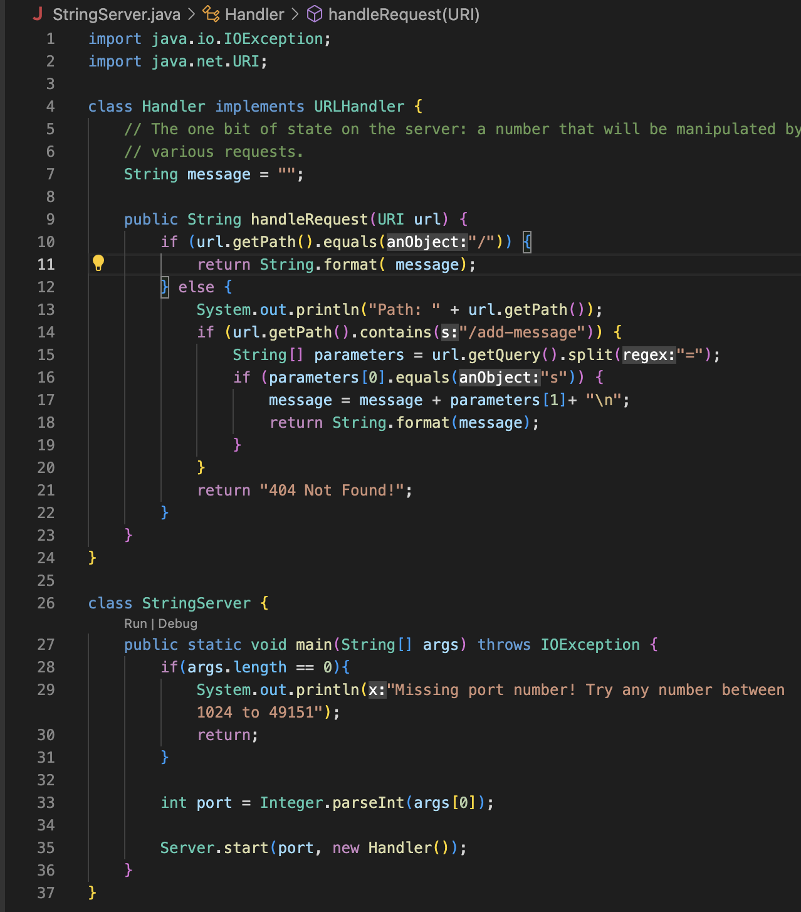
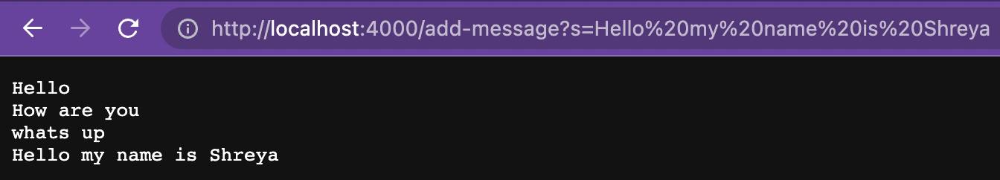
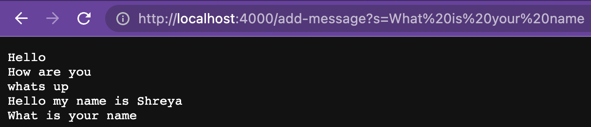

# Lab Report 2

Part 1:
In this part of the lab report, I had to write a web server called StringServer that could concatenate messages written by the user. The query would be writen in the url of the website and that would be printed out on the website alongside previous messages. The code that I used to make this program is in the screenshot below 

There are a couple of methods in my code that are called to make it work properly, more specfically I run handleRequest, handle, and start. The purpose of handleRequest is to take the information given in the url of the server and use it to return the message. The relevant arguements in this method the given url since with that url there is a array called paramters that locates the query and adds and returns the correct message. The string message is a changing and relevant field in the class since it changes whenever the url of the website changes and includes the right query. In addition, paramters is another field that is changing within the program. The next method I use is handle which is located in the Server class. The purpose of this code is to take the return statement after being handled by the code and then to write it onto the browser. The parameter exchange is a relevent argument to this method that is also changing as more messages are written on the web server. The final method that is called is start which creates a request entrypoint and starts the server. There are two arguements in this method, port and handler. The parameters don't change while the program is running because once the server starts it doesn't stop until the user closes the program and the port number doesn't change while the program is being run. 

The implementation of this method is shown in the next two screenshots where messages are being added. 

Part 2:

